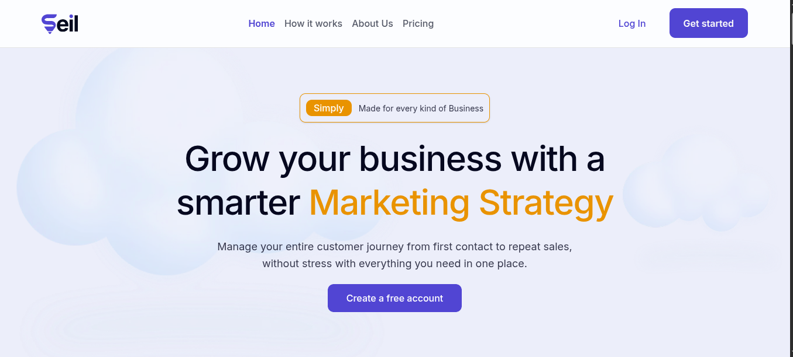

# SEIL — Guided Marketing Strategy for African SMBs

> **Turn your business story into a step-by-step marketing funnel in under 3 minutes.**

SEIL is a web-based marketing operations tool built for small and medium-sized business owners in Sub-Saharan Africa who have no prior marketing experience. It walks users through three phases — collect, generate, and guide — producing a personalised marketing funnel and a weekly execution plan they can act on immediately.



---

## Table of Contents

- [Product Overview](#product-overview)
- [The Problem](#the-problem)
- [Core Features](#core-features)
- [Tech Stack](#tech-stack)
- [Architecture](#architecture)
- [Project Structure](#project-structure)
- [API Reference](#api-reference)
- [Getting Started](#getting-started)
- [Environment Variables](#environment-variables)
- [Authentication Flow](#authentication-flow)
- [Known Issues & Status](#known-issues--status)
- [Contributing](#contributing)
- [Team](#team)

---

## Product Overview

SEIL removes the barrier between "I don't know marketing" and "I have a complete funnel and action plan." It does this through three sequential phases:

| Phase        | Description                                                                        | Target Time     |
| ------------ | ---------------------------------------------------------------------------------- | --------------- |
| **Collect**  | 3 plain-English intake questions about the business, or upload a business document | 30 seconds      |
| **Generate** | AI analyses intake answers and creates a personalised marketing funnel             | Under 3 seconds |
| **Guide**    | Walk the owner through each funnel stage week by week with checklists              | Ongoing         |

**Target users:** SMB owners aged 25–45 in Nigeria and Sub-Saharan Africa, solo entrepreneurs, and non-marketing business owners who need a done-for-you framework.

---

## The Problem

96% of SMBs in Sub-Saharan Africa lack structured marketing systems. Existing tools like HubSpot and Mailchimp are expensive (₦15,000+/month), built for dedicated marketing teams, and assume prior marketing knowledge. SEIL is built specifically for a sole trader running their entire business from an Android phone.

---

## Core Features

### MVP v2.0 (In Scope)

- **Email + password authentication** — sign up, log in, session management, email verification, password reset
- **Google OAuth 2.0** — one-click sign in with Google
- **Intake wizard** — 3 guided questions with auto-save after every interaction, or business document upload (PDF, DOCX, PPT — max 5MB, up to 3 files)
- **AI-powered funnel generation** — personalised marketing strategy from awareness to conversion
- **Stage execution dashboard** — Stages 1 through 4 with per-stage checklists
- **CTA lock system** — next stage unlocks only when all checklist items for the current stage are completed
- **One funnel per user account**
- **Mobile-first layout** — 375px minimum viewport, 44×44px minimum tap targets

### Out of Scope (MVP)

- CRM or campaign management
- Multi-channel marketing automation
- Paid subscription billing
- Multiple funnels per user
- WhatsApp/Instagram API integrations
- Multi-language support (English only)
- Team/multi-user accounts

---

## Tech Stack

| Layer            | Technology                                                 |
| ---------------- | ---------------------------------------------------------- |
| Frontend         | Next.js 15 (App Router), TypeScript, Tailwind CSS v4       |
| Backend          | NestJS, TypeScript                                         |
| Database         | PostgreSQL (primary), Redis (session cache, rate limiting) |
| Authentication   | Custom JWT, bcrypt (cost factor 12), NextAuth.js           |
| State Management | Zustand, TanStack Query v5                                 |
| HTTP Client      | Axios (server actions), native fetch (API routes)          |
| Email            | Resend SMTP                                                |
| File Upload      | Multipart form — max 5MB per file, 3 files per upload      |
| Hosting          | Vercel (frontend), Railway/Render (backend + DB)           |

---

## Architecture

SEIL's frontend follows a strict 4-layer request pattern. No component ever calls the backend directly.

```
Layer 1 — UI Component
    React components render UI and call hooks only.
    No HTTP logic lives here.
          ↓
Layer 2 — TanStack Query Hook
    useQuery (reads) and useMutation (writes) manage
    caching, loading state, error state, and polling.
          ↓
Layer 3 — Server Action  (src/actions/)
    "use server" functions run on the Next.js server.
    They attach the Bearer token and make HTTP calls via axios.
    Always return { ok: true, data } or { ok: false, error }.
          ↓
Layer 4 — Backend REST API  (NestJS)
    Receives authenticated requests, queries PostgreSQL,
    returns JSON. Documented in Swagger.
```

The frontend also exposes a small set of **Next.js API Route files** (`src/app/api/`) for cases that require a real HTTP endpoint — Google OAuth callback, waitlist proxy, and health check. These sit outside the 4-layer pattern and are called by the browser directly via `fetch`.

---

## Project Structure

```
flowbrand-ui/
├── public/                         # Static assets served at root
├── scripts/                        # Dev/build utility scripts
└── src/
    ├── app/                        # Next.js App Router — pages and API routes
    │   ├── (main)/                 # Route group for authenticated app shell
    │   ├── api/                    # API route handlers (BFF layer)
    │   │   ├── oauth/google/callback/  # Google OAuth callback handler
    │   │   ├── onboarding/         # Onboarding proxy route
    │   │   ├── waitlist/           # Waitlist proxy route
    │   │   └── health/             # Health check endpoint
    │   ├── onboarding/             # Onboarding page routes
    │   ├── error.tsx               # Global error boundary
    │   ├── layout.tsx              # Root layout
    │   ├── loading.tsx             # Root loading state
    │   ├── not-found.tsx           # 404 page
    │   ├── forbidden.tsx           # 403 page
    │   ├── unauthorized.tsx        # 401 page
    │   ├── robots.ts               # Robots.txt generation
    │   └── sitemap.ts              # Sitemap generation
    │
    ├── actions/                    # Next.js server actions
    │   ├── auth.ts                 # Authentication endpoints
    │   ├── funnels.ts              # Funnel generation and stages
    │   ├── onboarding.ts           # Onboarding session management
    │   └── contact.ts              # Contact form submission
    │
    ├── components/                 # Reusable UI components organised by domain
    │   ├── auth/                   # Login, signup, and auth flow components
    │   ├── dashboard/              # Dashboard layout and widgets
    │   ├── features/               # Feature-specific composite components
    │   ├── icons/                  # Icon components
    │   ├── landing/                # Marketing/landing page components
    │   ├── modals/                 # Modal dialogs
    │   ├── navigation/             # Nav bars, sidebars, breadcrumbs
    │   ├── providers/              # React context and query providers
    │   ├── settings/               # Settings page components
    │   ├── ui/                     # Base UI primitives (shadcn/ui)
    │   └── waitlist/               # Waitlist signup components
    │
    ├── config/                     # App-wide configuration
    │   ├── env.config.ts           # Centralised environment variable access
    │   └── auth.config.ts          # NextAuth configuration
    │
    ├── constants/                  # App-wide constant values
    │
    ├── features/                   # Self-contained feature modules
    │
    ├── hooks/                      # Custom React hooks
    │   ├── queries/                # Data-fetching hooks (useQuery)
    │   │   ├── use-strategy-funnel.ts      # Strategy polling and display
    │   │   ├── use-onboarding-queries.ts   # Onboarding data queries
    │   │   └── use-upload-queries.ts       # File upload queries
    │   └── mutations/              # Data-mutation hooks (useMutation)
    │       └── use-funnel-mutations.ts     # Funnel mutation actions
    │
    ├── lib/                        # Shared utilities and helpers
    │   ├── auth-api.ts             # Auth response parsers
    │   ├── funnel-api-types.ts     # Funnel response type parsers
    │   ├── funnel-query-fns.ts     # Query function bridge
    │   ├── onboarding-query-fns.ts # Onboarding query functions
    │   ├── funnel-generation-storage.ts    # sessionStorage management
    │   └── stage-progress-storage.ts       # localStorage stage progress
    │
    ├── schema/                     # Zod validation schemas
    │   ├── auth.schema.ts          # Auth form schemas
    │   ├── onboarding.ts           # Onboarding form schemas
    │   └── contact.schema.ts       # Contact form schema
    │
    ├── services/                   # External service integrations
    │
    ├── store/                      # Global client state (Zustand)
    │   └── useOnboardingStore.ts   # Onboarding flow state
    │
    ├── types/                      # Shared TypeScript type definitions
    │
    └── utils/                      # Pure utility functions
        ├── auth.ts                 # Auth helper utilities
        ├── proxy.ts                # Proxy helper utilities
        └── routes.ts               # Route constants and helpers
```

---

## API Reference

All backend endpoints are documented in the live Swagger UI:
**`https://api.staging.flowbrand.hng14.com/docs#`**

### Auth

| Method | Endpoint                     | Auth | Description                              |
| ------ | ---------------------------- | ---- | ---------------------------------------- |
| POST   | `/api/auth/register`         | ❌   | Create a new account                     |
| POST   | `/api/auth/login`            | ❌   | Email + password login                   |
| POST   | `/api/auth/send-otp`         | ❌   | Send email verification OTP              |
| POST   | `/api/auth/verify-otp`       | ❌   | Verify OTP, activate account             |
| POST   | `/api/auth/resend-otp`       | ❌   | Resend verification OTP                  |
| POST   | `/api/auth/forgot-password`  | ❌   | Request password reset OTP               |
| POST   | `/api/auth/verify-reset-otp` | ❌   | Verify reset OTP → returns `reset_token` |
| POST   | `/api/auth/reset-password`   | ❌   | Set new password using `reset_token`     |
| POST   | `/api/auth/refresh-token`    | ❌   | Rotate access token                      |
| POST   | `/api/auth/logout`           | ✅   | Revoke session                           |
| GET    | `/api/auth/me`               | ✅   | Get current user profile                 |
| GET    | `/auth/google`               | ❌   | Start Google OAuth flow                  |
| GET    | `/auth/google/callback`      | ❌   | Google OAuth callback                    |
| POST   | `/api/auth/google/exchange`  | ❌   | Exchange OAuth code for tokens           |

### Onboarding

| Method | Endpoint                   | Auth | Description                     |
| ------ | -------------------------- | ---- | ------------------------------- |
| POST   | `/api/onboarding/start`    | ✅   | Create a new onboarding session |
| POST   | `/api/onboarding/step`     | ✅   | Save a single step answer       |
| POST   | `/api/onboarding/complete` | ✅   | Mark onboarding as complete     |

### Funnels

| Method | Endpoint                                  | Auth | Description                           |
| ------ | ----------------------------------------- | ---- | ------------------------------------- |
| GET    | `/api/funnels`                            | ✅   | List all funnels (paginated)          |
| POST   | `/api/funnels/generate`                   | ✅   | Start funnel generation               |
| GET    | `/api/funnels/generate/stats/{funnelId}`  | ✅   | Poll generation status                |
| GET    | `/api/funnels/{id}`                       | ✅   | Get full funnel detail                |
| GET    | `/api/funnels/{id}/stages`                | ✅   | Get all stages summary                |
| GET    | `/api/funnels/{id}/stages/{stageId}`      | ✅   | Get single stage with tasks           |
| POST   | `/api/funnels/upload`                     | ✅   | Upload business documents (multipart) |
| GET    | `/api/funnels/upload/progress/{uploadId}` | ✅   | Poll upload processing status         |

---

## Getting Started

### Prerequisites

- Node.js 18.17+
- pnpm
- Access to the staging backend

### Installation

```bash
# Clone the repository
git clone https://github.com/hngprojects/flowbrand-ui.git
cd flowbrand-ui

# Install dependencies
pnpm install

# Copy the environment template
cp .env.example .env.local
```

### Running locally

```bash
pnpm dev
# App runs on http://localhost:3000
```

---

## Scripts

| Command          | What it does                     |
| ---------------- | -------------------------------- |
| `pnpm dev`       | Dev server                       |
| `pnpm build`     | Production build (validates env) |
| `pnpm start`     | Run the production build         |
| `pnpm lint`      | ESLint                           |
| `pnpm typecheck` | `tsc --noEmit`                   |

---

### Enabling debug logging

To see every API request and response logged to the browser console:

```js
// Paste in browser DevTools console, then reload the page
sessionStorage.setItem("flowbrand_debug", "1");

// To disable
sessionStorage.removeItem("flowbrand_debug");
```

---

## Authentication Flow

### Email + Password

```
Register → POST /api/auth/register
        → POST /api/auth/send-otp  (verification email sent)
        → User enters OTP
        → POST /api/auth/verify-otp  (account activated, access token returned)
        → Redirect to onboarding
```

### Google OAuth

```
User clicks "Sign in with Google"
        → GET /auth/google  (backend redirects to Google)
        → Google redirects to GET /api/oauth/google/callback  (Next.js route)
        → Route exchanges code → POST /api/auth/google/exchange
        → NextAuth session created
        → Redirect to dashboard or onboarding
```

### Password Reset

```
User clicks "Forgot password?"
        → POST /api/auth/forgot-password  { email }
        → OTP sent to email
        → POST /api/auth/verify-reset-otp  { email, otp_code }
        → Returns { reset_token }  — valid for 15 minutes
        → POST /api/auth/reset-password  { reset_token, password }
        → Session created, redirect to dashboard
```

---

## Contributing

This project is built during the HNG14 internship sprint. All contributions go through pull requests.

### Branch naming

```
feature/your-feature-name
fix/what-youre-fixing
chore/what-youre-updating
```

### Before opening a PR

- Run `pnpm run lint` and fix all errors
- Test on mobile viewport (375px) — this is the primary user viewport
- Confirm your `.env.local` is pointing at staging
- Check the Network tab in DevTools — no request should be returning 404

---

## Team

Built by the SEIL frontend team during the HNG14 Internship.

| Role               | Responsibility                                                |
| ------------------ | ------------------------------------------------------------- |
| Frontend Engineers | Next.js, TanStack Query, component library                    |
| Backend Engineers  | NestJS, PostgreSQL, REST API                                  |
| DevOps             | Vercel deployment, Railway/Render backend, environment config |
| Design             | Figma components, design tokens, mobile-first wireframes      |

---

## License

This project was built as part of the HNG Internship programme. All rights reserved by the SEIL product team.
